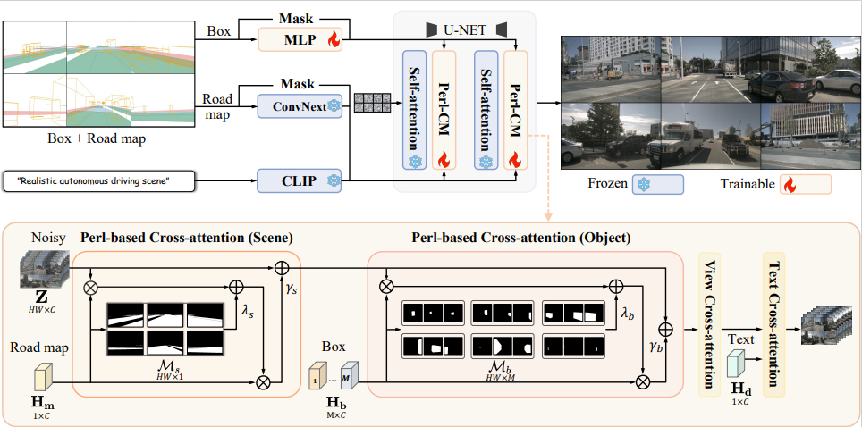
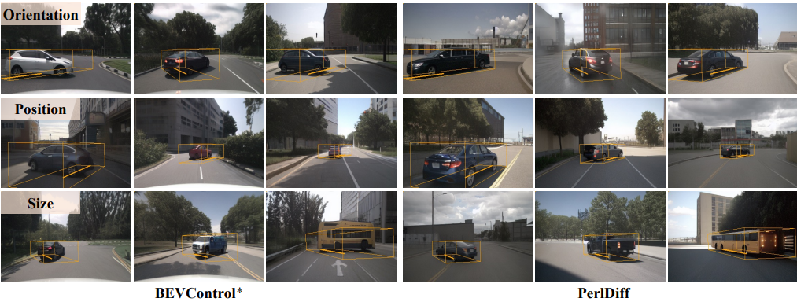

# PerlDiff：Controllable Street View Synthesis Using Perspective-Layout Diffusion Models
This repository is the official PyTorch implementation of PerlDiff: Controllable Street View Synthesis Using Perspective-Layout Diffusion Models.

> Controllable generation is considered a potentially vital approach to address the challenge of annotating 3D data, and the precision of such controllable generation becomes particularly imperative in the context of data production for autonomous driving. Existing methods focus on the integration of diverse generative information into controlling inputs, utilizing frameworks such as GLIGEN or ControlNet, to produce commendable outcomes in controllable generation. However, such approaches intrinsically restrict generation performance to the learning capacities of predefined network architectures. In this paper, we explore the integration of controlling information and introduce PerlDiff (Perspective-Layout Diffusion Models), a method for effective street view image generation that fully leverages perspective 3D geometric information. PerlDiff employs 3D geometric priors to guide the generation of street view images with precise object-level control within the network learning process, resulting in a more robust and controllable output. Moreover, it demonstrates superior controllability compared to alternative layout control methods. Empirical results justify that PerlDiff markedly enhances the precision of generation on the NuScenes and KITTI datasets.

---

**[PerlDiff：Controllable Street View Synthesis Using Perspective-Layout Diffusion Models](https://arxiv.org/abs/2407.06109)**

[Jinhua Zhang](https://nuanbaobao.github.io/), [Hualian Sheng](https://scholar.google.com/citations?user=73JaDUQAAAAJ&hl=zh-CN&oi=sra), [Sijia Cai](https://scholar.google.com/citations?user=LMVeRVAAAAAJ&hl=zh-CN&oi=sra), [Bing Deng](https://scholar.google.com/citations?user=VQp_ye4AAAAJ&hl=zh-CN&oi=sra), [Qiao Liang](https://scholar.google.com/citations?user=-Hv_dPkAAAAJ&hl=zh-CN), [Wen Li](https://scholar.google.com/citations?user=yjG4Eg4AAAAJ&hl=zh-CN), [Ying Fu](https://scholar.google.com/citations?user=PE4xMlkAAAAJ&hl=zh-CN), [Jieping Ye](https://scholar.google.com/citations?user=T9AzhwcAAAAJ&hl=zh-CN), [Shuhang Gu](https://scholar.google.com/citations?user=-kSTt40AAAAJ&hl=zh-CN)

  
 
<em>PerlDiff utilizes perspective layout masking maps derived from BEV annotations to integrate scene information and object bounding boxes for multi view street scene generation</em>

  
 

## News
- [8 July. 2024] ✨  Paper Released!

## Code Usage
**Codes will be coming soon!**
